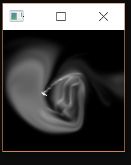
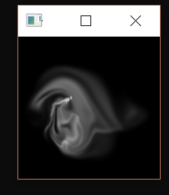
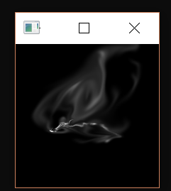

# Object-Oriented-Fluid-Simulator
Euler/Mesh based fluid simulation approach based on Jos Stam's 1999 paper on stable and fast fluid simulations. The current project is limited to a 100x100 mesh, but will be expanded soon. Dye can be added to the fluid by holding the left mouse, and stirring.
A working executable can be run from the release folder.
More features (and one bug fix) will come soon.

